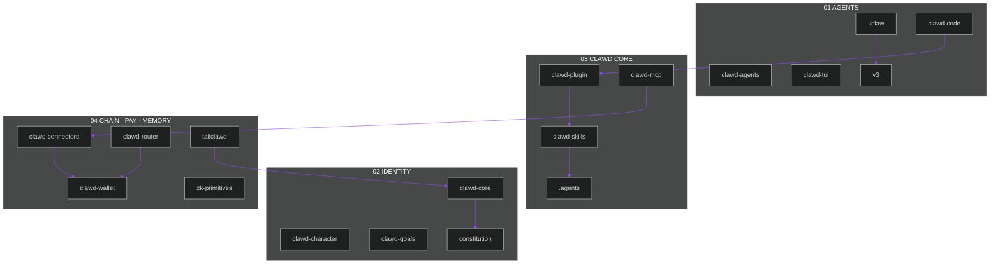

<div align="center">


<p>
  <a href="https://phantom.com/tokens/solana/8cHzQHUS2s2h8TzCmfqPKYiM4dSt4roa3n7MyRLApump"></a>
  <a href="https://dexscreener.com/solana/8cHzQHUS2s2h8TzCmfqPKYiM4dSt4roa3n7MyRLApump"></a>
  <a href="https://jup.ag/swap/SOL-8cHzQHUS2s2h8TzCmfqPKYiM4dSt4roa3n7MyRLApump"></a>
  <a href="LICENSE"></a>
  <a href="SECURITY.md"></a>
</p>

```text
Token   $CLAWD · 8cHzQHUS2s2h8TzCmfqPKYiM4dSt4roa3n7MyRLApump
Public  github.com/Solizardking/core-ai
```

</div>

# Clawd Core AI

Public lobster-native Solana agent stack. **Clawd is the identity. Helius is the pipe.**

This repository is Core AI as its own GitHub product — not a nested folder. Clone it, run `./claw`, compile skills, talk to the chain.


## Live map

Agents on top. Identity in the shell. Chain, pay, and memory at the edge. Packets never stop.

<div align="center">
  
</div>



## Quick start

```bash
git clone https://github.com/Solizardking/core-ai.git
cd core-ai
chmod +x claw
npm run verify
./claw --help
```

Agent loop:

```bash
clawd --plugin-dir ./clawd-plugin
```

MCP-only in `.clawd/settings.json`:

```json
{
  "mcpServers": {
    "clawd": {
      "command": "npx",
      "args": ["clawd-mcp@latest"]
    }
  }
}
```

Copy [`.env.example`](./.env.example). Never commit a filled `.env`. Keys live in `~/.clawd/config.json`.

## Directory map

Canonical list. Enforced by [`MANIFEST.json`](./MANIFEST.json) and `npm run verify`.

### Required packages

| Path | Layer | What it is | How to run |
|---|---|---|---|
| [`.agents`](./.agents) | generated | Compiled skills and prompt variants from `clawd-skills` | `npm run compile-skills` — do not edit by hand |
| [`.clawd-plugin`](./.clawd-plugin) | plugin | Marketplace descriptor for the plugin bundle | [`marketplace.json`](./.clawd-plugin/marketplace.json) |
| [`.github`](./.github) | ops | Public GitHub Actions for this repo | CI on `main` / `newnew` |
| [`clawd-agents`](./clawd-agents) | agents | x402, PumpFun, Go, and Grok agent runtimes | see each subdirectory README |
| [`clawd-character`](./clawd-character) | identity | Eliza-compatible Clawd persona JSON | `node --test clawd-character/tests/*.test.mjs` |
| [`clawd-code`](./clawd-code) | agents | Solana-native AI coding CLI, paper-gated perps | `cd clawd-code && npm install && npm run build` |
| [`clawd-connectors`](./clawd-connectors) | edge | MCP connectors: DFlow, Helius, Jupiter, Birdeye | `cd clawd-connectors && npm install && npm run build` |
| [`clawd-core`](./clawd-core) | core | Identity umbrella + machine-readable catalog | `node clawd-core/src/cli.mjs catalog` |
| [`clawd-goals`](./clawd-goals) | identity | Active mission files injected into agent prompts | `node --test clawd-goals/tests/*.test.mjs` |
| [`clawd-mcp`](./clawd-mcp) | core | MCP server — 9 routed domain tools + `expandResult` | `npx clawd-mcp@latest` |
| [`clawd-plugin`](./clawd-plugin) | plugin | Clawd Code plugin: skills + auto-start MCP | `clawd --plugin-dir ./clawd-plugin` |
| [`clawd-router`](./clawd-router) | edge | OpenAI-compatible LLM router, CLAWD gating, x402 | `cd clawd-router && npm install && npm start` |
| [`clawd-skills`](./clawd-skills) | core | Canonical `SKILL.md` source | `./clawd-skills/clawd/install.sh` |
| [`clawd-tui`](./clawd-tui) | agents | Terminal operator (doctor/theme) + upstream TUI | `node clawd-tui/src/cli.mjs doctor` |
| [`clawd-wallet`](./clawd-wallet) | edge | Privy embedded Solana wallet, Jupiter swaps | `cd clawd-wallet && npm install && npm run build` |
| [`constitution`](./constitution) | identity | Constitution + hash-attested Three On-Chain Laws | `node constitution/hash.mjs` |
| [`knowledge`](./knowledge) | memory | Facts, gotchas, patterns, architecture notes | read-only |
| [`mcp-server`](./mcp-server) | edge | Pump SDK MCP (builds txs, does not submit) | `npm run mcp:pump:start` |
| [`scripts`](./scripts) | ops | Skill compiler, structure check, secret scan | `npm run verify` |
| [`tailclawd`](./tailclawd) | ops | Operator dashboard — sessions, metrics, health | `npm run tailclawd:start` → `http://127.0.0.1:4402` |
| [`v3`](./v3) | agents | Next-gen unified Clawd runtime scaffold | `./claw` or `cd v3 && npm start` |
| [`zk-primitives`](./zk-primitives) | edge | Light Protocol ZK: nullifiers, Groth16, compressed state | see [`zk-primitives/README.md`](./zk-primitives/README.md) |

### Root files

| File | What it is |
|---|---|
| [`claw`](./claw) | Public operator launcher → `v3` runtime |
| [`.gitignore`](./.gitignore) | Secrets, `node_modules`, build output |
| [`.npmrc`](./.npmrc) | npm publish policy (`minimum-release-age`) |
| [`AGENTS.md`](./AGENTS.md) | Layer A harness for Clawd-compatible agents |
| [`CLAUDE.md`](./CLAUDE.md) | Compatibility shim |
| [`CLAWD.md`](./CLAWD.md) | Canonical Clawd operator instructions |
| [`CONTRIBUTING.md`](./CONTRIBUTING.md) | Signed-commit guidance + `npm run verify` |
| [`glama.json`](./glama.json) | Glama MCP maintainer record |
| [`LICENSE`](./LICENSE) | MIT |
| [`package.json`](./package.json) | Workspace scripts (`verify`, `catalog`, MCP helpers) |
| [`package-lock.json`](./package-lock.json) | Root lockfile |
| [`README.md`](./README.md) | This map |
| [`versions.json`](./versions.json) | Skill / prompt version pins |

### Also in this tree

| Path | Layer | What it is | How to run |
|---|---|---|---|
| [`clawd-cli`](./clawd-cli) | core | Helius account setup, DAS/RPC, staking, ZK compression | `npm install -g clawd-cli` |
| [`clawd-cursor`](./clawd-cursor) | plugin | Cursor skills, rules, and MCP config | Cursor marketplace / local plugin dir |
| [`clawd-grok`](./clawd-grok) | agents | Bun-native Grok runtime (default `grok-4.6`) | `cd clawd-grok && bun install && bun run dev` |
| [`clawd-perps-agent`](./clawd-perps-agent) | agents | Phoenix, Vulcan, Imperial, TWAMM, Telegram | `cd clawd-perps-agent && npm install && npm run build` |
| [`membrain`](./membrain) | memory | Selective memory daemon — gRPC `:9090` | `cd membrain && make build && ./bin/membraned` |
| [`solana-mcp`](./solana-mcp) | edge | Solana docs MCP — RAG + canonical retrieval | `npm run mcp:solana:dev` → `http://localhost:8080/mcp` |
| [`docs`](./docs) | ops | ADRs and animated SVG maps | read-only |
| [`convex`](./convex) | ops | Convex helpers used by gateway surfaces | package-local |

## MCP servers

| Server | Path / package | Transport | Command / URL |
|---|---|---|---|
| Clawd MCP | [`clawd-mcp`](./clawd-mcp) | stdio | `npx clawd-mcp@latest` |
| Pump MCP | [`mcp-server`](./mcp-server) | stdio or HTTP | `npm run mcp:pump:start` |
| Solana Docs MCP | [`solana-mcp`](./solana-mcp) | HTTP `:8080` | `npm run mcp:solana:dev` |
| Connectors | [`clawd-connectors`](./clawd-connectors) | HTTP MCP | see `.mcp.json` |
| ZK Compression | [`zk-primitives`](./zk-primitives) + external | HTTP | `https://www.zkcompression.com/mcp` |

## Identity and law

- [`constitution/`](./constitution) — never harm, earn your existence, never deceive. Spawn pipelines record `sha256(three-laws.md)`.
- [`clawd-character/`](./clawd-character) — persona JSON loaded at spawn.
- [`clawd-goals/`](./clawd-goals) — active missions (`active: true`) injected into prompts.
- [`knowledge/`](./knowledge) — operator memory.

## Verify

```bash
npm run verify          # structure + secrets + keyless tests
npm run catalog         # print the package map
./claw --help           # v3 operator
npm run tailclawd:start # http://127.0.0.1:4402
```

When this tree is the GitHub root, [`.github/workflows/ci.yml`](./.github/workflows/ci.yml) runs the same verify job. Update this README in the same change whenever you add or rename a package.
