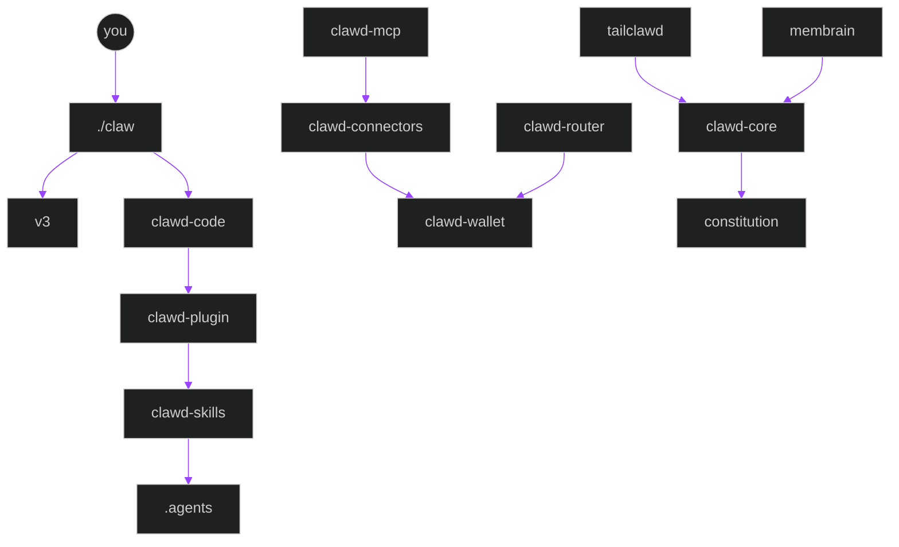

<div align="center">


[](https://github.com/Solizardking/clawd-cloud)

**The complete harness for Solana and blockchain-native financial agents — one checkout, one router, live MCP.**

<br />

[](https://github.com/Solizardking/clawd-cloud/stargazers)
[](https://github.com/Solizardking/clawd-cloud/network/members)
[](https://github.com/Solizardking/clawd-cloud/commits)
[](https://github.com/Solizardking/clawd-cloud/issues)

[](https://www.npmjs.com/package/clawd-mcp)
[](LICENSE)
[](https://nodejs.org)
[](https://solana.com)
[](https://modelcontextprotocol.io)
[](SECURITY.md)

[](https://phantom.com/tokens/solana/8cHzQHUS2s2h8TzCmfqPKYiM4dSt4roa3n7MyRLApump)
[](https://dexscreener.com/solana/8cHzQHUS2s2h8TzCmfqPKYiM4dSt4roa3n7MyRLApump)
[](https://birdeye.so/token/8cHzQHUS2s2h8TzCmfqPKYiM4dSt4roa3n7MyRLApump)
[](https://jup.ag/swap/SOL-8cHzQHUS2s2h8TzCmfqPKYiM4dSt4roa3n7MyRLApump)

`8cHzQHUS2s2h8TzCmfqPKYiM4dSt4roa3n7MyRLApump`

<br />


</div>

---

## 60-second start

```bash
git clone https://github.com/Solizardking/clawd-cloud.git
cd clawd-cloud
chmod +x claw clawd
cp .env.example .env.local          # add HELIUS_API_KEY (and any LLM keys)
npm run stack:doctor                # prove plugin, MCP, operator, catalog can see each other
./claw cloud                        # destinations + capabilities + routes
./clawd --plugin-dir ./clawd-plugin
```

Or skip the checkout and run the MCP server:

```bash
npx clawd-mcp@latest
```

> **Trading is PAPER by default.** Live orders require `LIVE_TRADING=true`, `OPERATOR_CONFIRMED=true`, and `PERPS_SIM_ONLY=false`. Never commit `.env` / `.env.local`.

<p align="center">
  
</p>



---

## What you just cloned

Four layers that already speak through one router — `./claw`. Every package in [`MANIFEST.json`](MANIFEST.json) is a registered destination.

<table>
<tr>
<td width="25%" align="center">

### 🦞 Agents

CLI · TUI · v3 runtime

[`clawd-code/`](clawd-code/)
[`clawd-agents/`](clawd-agents/)
[`v3/`](v3/)

💻 CODE · 📈 TRADE · 🔬 RESEARCH

</td>
<td width="25%" align="center">

### 🪪 Identity

Laws · persona · goals

[`clawd-core/`](clawd-core/)
[`constitution/`](constitution/)
[`clawd-character/`](clawd-character/)

six laws · spawn hash

</td>
<td width="25%" align="center">

### 🧠 Core

Skills · plugin · MCP

[`clawd-plugin/`](clawd-plugin/)
[`clawd-skills/`](clawd-skills/)
[`clawd-mcp/`](clawd-mcp/)

10 public tools

</td>
<td width="25%" align="center">

### 🔌 Edge

Chain · pay · memory

[`clawd-connectors/`](clawd-connectors/)
[`clawd-wallet/`](clawd-wallet/)
[`membrain/`](membrain/)

DFlow · Helius · Jupiter

</td>
</tr>
</table>



<div align="center">
  
</div>

| Capability | Destinations | Addressable without |
| --- | --- | --- |
| `chain` / `mcp` | `clawd-mcp`, `clawd-connectors`, `solana-mcp`, `mcp-server` | live RPC |
| `wallet` / `pay` | `clawd-wallet`, `clawd-router` | a funded wallet |
| `perps` / `trade` | `clawd-perps-agent`, `v3` | live orders (paper first) |
| `memory` | `membrain` | a running daemon to *name* it |

```bash
./claw --help
./claw cloud
./claw status
./claw route v3 chain "get slot"
./claw route operator wallet "quote"
./claw route clawd-code perps "paper"
./claw route v3 memory "recall"
npm run catalog
```

The shipped router returns `delivered`, `unreachable`, or `unsupported`.

---

## Modes

```bash
clawd-code code "build a Jupiter swap bot with slippage protection"
clawd-code trade "what's the funding rate on SOL perps?"
clawd-code research "compare AutoGPT, LangChain, CrewAI, AutoGen"
clawd-code image "cyberpunk Solana trading desk"
clawd-code voice --persona eve
clawd-code arena status
```

<table>
<tr>
<td align="center" width="20%">💻<br/><b>CODE</b><br/><sub>stream, review, ship</sub></td>
<td align="center" width="20%">📈<br/><b>TRADE</b><br/><sub>Phoenix + Vulcan · paper first</sub></td>
<td align="center" width="20%">🔬<br/><b>RESEARCH</b><br/><sub>long-context synthesis</sub></td>
<td align="center" width="20%">🎨<br/><b>IMAGE</b><br/><sub>x402-paid gen</sub></td>
<td align="center" width="20%">🎙️<br/><b>VOICE</b><br/><sub>eve / ara / rex / sal</sub></td>
</tr>
</table>

---

## Connectors

```ts
import { createConnectors } from "@openclawd/clawd-connectors";

const connectors = createConnectors();
await connectors.helius.rpc("getBalance", ["YourPubkeyHere"]);
await connectors.dflow.callTool("open_position", { size: 10 });
```

Shared registry: [`.mcp.json`](.mcp.json) (repo root, `clawd-connectors/`, and `clawd-plugin/`).

| Server | How it loads |
| --- | --- |
| DFlow / Helius / Jupiter / Birdeye | HTTP MCP from [`clawd-connectors/`](clawd-connectors/) |
| ZK Compression | HTTP MCP `https://www.zkcompression.com/mcp` |
| clawd-mcp | `npx clawd-mcp@latest` — 9 routed domain tools + `expandResult` |
| Pump MCP | [`mcp-server/`](mcp-server/) — builds txs, does not submit |
| Solana Docs MCP | [`solana-mcp/`](solana-mcp/) → `http://localhost:8080/mcp` |

Keys live in [`.env.example`](.env.example) — copy to `.env.local`.

---

## Directory map

Canonical list. Enforced by [`MANIFEST.json`](MANIFEST.json) and `npm run verify`.

### Required packages

| Path | Layer | What it is | How to run |
|---|---|---|---|
| [`.agents`](.agents) | generated | Compiled skills from `clawd-skills` | `npm run compile-skills` — do not edit by hand |
| [`.clawd-plugin`](.clawd-plugin) | plugin | Marketplace descriptor for the plugin bundle | [`marketplace.json`](.clawd-plugin/marketplace.json) |
| [`.github`](.github) | ops | Public GitHub Actions for this repo | CI on `main` / `newnew` |
| [`clawd-agents`](clawd-agents) | agents | x402, PumpFun, Go, and Grok agent runtimes | see each subdirectory README |
| [`clawd-character`](clawd-character) | identity | Eliza-compatible Clawd persona JSON | `node --test clawd-character/tests/*.test.mjs` |
| [`clawd-code`](clawd-code) | agents | Solana-native AI coding CLI, paper-gated perps | `cd clawd-code && npm install && npm run build` |
| [`clawd-connectors`](clawd-connectors) | edge | MCP connectors: DFlow, Helius, Jupiter, Birdeye | `cd clawd-connectors && npm install && npm run build` |
| [`clawd-core`](clawd-core) | core | Identity umbrella + machine-readable catalog | `node clawd-core/src/cli.mjs catalog` |
| [`clawd-goals`](clawd-goals) | identity | Active mission files injected into agent prompts | `node --test clawd-goals/tests/*.test.mjs` |
| [`clawd-mcp`](clawd-mcp) | core | MCP server — 9 routed domain tools + `expandResult` | `npx clawd-mcp@latest` |
| [`clawd-plugin`](clawd-plugin) | plugin | Clawd Code plugin: skills + auto-start MCP | `./clawd --plugin-dir ./clawd-plugin` |
| [`clawd-router`](clawd-router) | edge | OpenAI-compatible LLM router, CLAWD gating, x402 | `cd clawd-router && npm install && npm start` |
| [`clawd-skills`](clawd-skills) | core | Canonical `SKILL.md` source | `./clawd-skills/clawd/install.sh` |
| [`clawd-tui`](clawd-tui) | agents | Terminal operator (doctor/theme) + upstream TUI | `node clawd-tui/src/cli.mjs doctor` |
| [`clawd-wallet`](clawd-wallet) | edge | Privy embedded Solana wallet, Jupiter swaps | `cd clawd-wallet && npm install && npm run build` |
| [`constitution`](constitution) | identity | Constitution + hash-attested Three On-Chain Laws | `node constitution/hash.mjs` |
| [`knowledge`](knowledge) | memory | Facts, gotchas, patterns, architecture notes | read-only |
| [`mcp-server`](mcp-server) | edge | Pump SDK MCP (builds txs, does not submit) | `npm run mcp:pump:start` |
| [`scripts`](scripts) | ops | Skill compiler, structure check, secret scan, doctor | `npm run verify` |
| [`tailclawd`](tailclawd) | ops | Operator dashboard — sessions, metrics, health | `npm run tailclawd:start` → `http://127.0.0.1:4402` |
| [`v3`](v3) | agents | Next-gen unified Clawd runtime scaffold | `./claw` or `cd v3 && npm start` |
| [`zk-primitives`](zk-primitives) | edge | Light Protocol ZK: nullifiers, Groth16, compressed state | see [`zk-primitives/README.md`](zk-primitives/README.md) |

### Also in this tree

| Path | Layer | What it is | How to run |
|---|---|---|---|
| [`.claude-plugin`](.claude-plugin) | plugin | Claude-compatible marketplace → `./clawd-plugin` | [`marketplace.json`](.claude-plugin/marketplace.json) |
| [`clawd-cli`](clawd-cli) | core | Helius account setup, DAS/RPC, staking, ZK compression | `npm install -g clawd-cli` |
| [`clawd-cursor`](clawd-cursor) | plugin | Cursor skills, rules, and MCP config | Cursor marketplace / local plugin dir |
| [`clawd-grok`](clawd-grok) | agents | Bun-native Grok runtime (default `grok-4.6`) | `cd clawd-grok && bun install && bun run dev` |
| [`clawd-perps-agent`](clawd-perps-agent) | agents | Phoenix, Vulcan, Imperial, TWAMM, Telegram | `cd clawd-perps-agent && npm install && npm run build` |
| [`membrain`](membrain) | memory | Selective memory daemon — gRPC `:9090` | `cd membrain && make build && ./bin/membraned` |
| [`solana-mcp`](solana-mcp) | edge | Solana docs MCP — RAG + canonical retrieval | `npm run mcp:solana:dev` → `http://localhost:8080/mcp` |
| [`docs`](docs) | ops | ADRs and animated SVG maps | [architecture](docs/architecture.md) |
| [`convex`](convex) | ops | Convex helpers used by gateway surfaces | package-local |
| [`outputs`](outputs) | ops | Local gallery / generated artifacts | runtime — contents gitignored |

### Root files

| File | What it is |
|---|---|
| [`claw`](claw) | Public operator launcher → `v3` runtime |
| [`clawd`](clawd) | Same operator — so `./clawd --plugin-dir ./clawd-plugin` works without a global install |
| [`.editorconfig`](.editorconfig) | Editor defaults (LF, 2-space indent) |
| [`.env.example`](.env.example) | Operator env template — copy to `.env.local` |
| [`.gitattributes`](.gitattributes) | LF normalization |
| [`.mcp.json`](.mcp.json) | Root MCP registry (DFlow, Helius, Jupiter, Birdeye, clawd-mcp) |
| [`.gitignore`](.gitignore) | Secrets, `node_modules`, build output |
| [`.npmrc`](.npmrc) | npm project config |
| [`.nvmrc`](.nvmrc) | Node 20 |
| [`AGENTS.md`](AGENTS.md) | Layer A harness for Clawd-compatible agents |
| [`CLAUDE.md`](CLAUDE.md) | Compatibility shim for runtimes that auto-load it |
| [`CLAWD.md`](CLAWD.md) | Canonical Clawd operator instructions |
| [`CODE_OF_CONDUCT.md`](CODE_OF_CONDUCT.md) | Contributor Covenant |
| [`CONTRIBUTING.md`](CONTRIBUTING.md) | Signed-commit guidance + `npm run verify` |
| [`glama.json`](glama.json) | Glama MCP maintainer record |
| [`LICENSE`](LICENSE) | MIT |
| [`MANIFEST.json`](MANIFEST.json) | Machine-readable package catalog |
| [`NOTICE.md`](NOTICE.md) | Upstream sources |
| [`package.json`](package.json) | Workspace scripts (`verify`, `catalog`, `stack:doctor`) |
| [`package-lock.json`](package-lock.json) | Root lockfile |
| [`README.md`](README.md) | This map |
| [`SECURITY.md`](SECURITY.md) | Vulnerability reporting + paper-default trading |
| [`versions.json`](versions.json) | Skill / prompt version pins |



---

## Identity and law

- [`constitution/`](constitution/) — never harm, earn your existence, never deceive. Spawn pipelines record `sha256(three-laws.md)`.
- [`clawd-character/`](clawd-character/) — persona JSON loaded at spawn.
- [`clawd-goals/`](clawd-goals/) — active missions (`active: true`) injected into prompts.
- [`knowledge/`](knowledge/) — operator memory.
- [`AGENTS.md`](AGENTS.md) / [`CLAWD.md`](CLAWD.md) — Layer A harness. Skills in `.agents/skills/` are Layer B.

---

## Develop

```bash
npm run stack:doctor    # plugin + MCP + operator + catalog
npm run verify          # structure + secrets + keyless tests
npm run catalog         # print the assembled Clawd Cloud map
./claw cloud
npm run tailclawd:start # http://127.0.0.1:4402
```

Docs: [architecture](docs/architecture.md) · [ADR](docs/adr/ADR-001-open-clawd-v2.md) · [publish](docs/PUBLISH.md)

When you add or rename a package, update this README in the same change. `scripts/check-structure.mjs` enforces the map.

---

## npm packages

Install from this checkout, or from npm when published. Root `clawd-cloud` stays **private** — it is the GitHub monorepo, not an npm tarball.

| Package | npm | Command |
| --- | --- | --- |
| Clawd MCP | [`clawd-mcp`](https://www.npmjs.com/package/clawd-mcp) | `npx clawd-mcp@latest` |
| Clawd CLI | [`clawd-cli`](https://www.npmjs.com/package/clawd-cli) | `npx clawd-cli@latest` |
| Connectors | [`@openclawd/clawd-connectors`](https://www.npmjs.com/package/@openclawd/clawd-connectors) | `npm i @openclawd/clawd-connectors` |
| Catalog | [`@clawd/core`](https://www.npmjs.com/package/@clawd/core) | `npx clawd-core catalog` |
| Clawd Code | [`@solana-clawd/clawd-code`](https://www.npmjs.com/package/@solana-clawd/clawd-code) | `npx @solana-clawd/clawd-code` |
| Wallet | [`@openclawd/wallet`](https://www.npmjs.com/package/@openclawd/wallet) | `npm i @openclawd/wallet` |
| Tailclawd | [`@clawd/tailclawd`](https://www.npmjs.com/package/@clawd/tailclawd) | `npx tailclawd` |
| TUI | [`@clawd/tui`](https://www.npmjs.com/package/@clawd/tui) | `npx clawd-tui` |

In-tree only (not published as their npm names from this repo): `mcp-server` (`@pump-fun/mcp-server`), `solana-mcp`, `membrain` clients, `clawd-grok`, `v3`. Use the GitHub paths.

Publish a tagged MCP release with `git tag clawd-mcp@x.y.z && git push origin clawd-mcp@x.y.z` — see [`.github/workflows/mcp-publish.yml`](.github/workflows/mcp-publish.yml).

---

## Contributing

PRs welcome on docs, connectors, Core skills, MCP tools, and stack wiring.

1. Fork → branch off `main` (or `newnew`).
2. Keep diffs small. Match nearby TypeScript / ESM style.
3. `npm run verify` and any tests for the package you touched.
4. Never commit secrets, keypairs, or live-trading flags flipped on.

See [`CONTRIBUTING.md`](CONTRIBUTING.md), [`CODE_OF_CONDUCT.md`](CODE_OF_CONDUCT.md), and [`SECURITY.md`](SECURITY.md).

---

## License

MIT. See [`LICENSE`](LICENSE) and [`NOTICE.md`](NOTICE.md).

`constitution/CONSTITUTION.md` and `constitution/three-laws.md` are CC0 1.0.

---

<div align="center">

**Star this repo** if the stack is useful — it is the best signal that the lobster should keep molting in public.

[](https://star-history.com/#Solizardking/clawd-cloud&Date)

[Clawd Code](clawd-code/) · [Connectors](clawd-connectors/) · [Plugin](clawd-plugin/) · [Issues](https://github.com/Solizardking/clawd-cloud/issues) · [$CLAWD](https://phantom.com/tokens/solana/8cHzQHUS2s2h8TzCmfqPKYiM4dSt4roa3n7MyRLApump)


<sub>🦞 MIT · paper trading by default · PRs welcome</sub>

</div>
