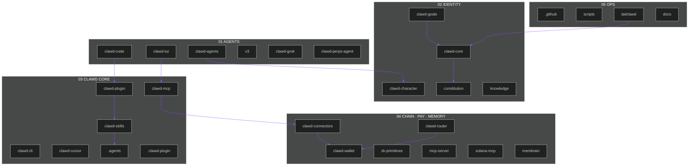

<div align="center">


<p>
  <a href="https://phantom.com/tokens/solana/8cHzQHUS2s2h8TzCmfqPKYiM4dSt4roa3n7MyRLApump"></a>
  <a href="LICENSE"></a>
  <a href="../SECURITY.md"></a>
</p>

```text
Token   $CLAWD · 8cHzQHUS2s2h8TzCmfqPKYiM4dSt4roa3n7MyRLApump
Repo    github.com/Solizardking/clawd-cloud · tree core-ai/
```

</div>

# Clawd Core AI

Enterprise map of the Clawd Core stack. **Clawd Core is the identity. Helius is the pipe.**

This directory is what GitHub deploys. Every required package is listed in [`MANIFEST.json`](./MANIFEST.json) and must appear in the tables below. CI runs `npm run verify` from this folder: structure map, secret scan, and keyless unit tests.

## Architecture

Agents on top. Identity and skills in the middle. Chain, payments, and memory at the edge.



Animated map: [`docs/assets/clawd-core-map.svg`](./docs/assets/clawd-core-map.svg).

## Directory map

Canonical list. Paths are relative to `core-ai/`.

### Required packages

| Path | Layer | What it is | How to run |
|---|---|---|---|
| [`.agents`](./.agents) | generated | Compiled skills and prompt variants from `clawd-skills` | `npm run compile-skills` — do not edit by hand |
| [`.clawd-plugin`](./.clawd-plugin) | plugin | Marketplace descriptor for the plugin bundle | read [`marketplace.json`](./.clawd-plugin/marketplace.json) |
| [`.github`](./.github) | ops | Package-level workflow templates | live Actions are at repo-root `.github/` |
| [`clawd-agents`](./clawd-agents) | agents | x402, PumpFun, Go, and Grok agent runtimes | see each subdirectory README |
| [`clawd-character`](./clawd-character) | identity | Eliza-compatible Clawd persona JSON | `node --test clawd-character/tests/*.test.mjs` |
| [`clawd-code`](./clawd-code) | agents | Solana-native AI coding CLI, paper-gated perps | `cd clawd-code && npm install && npm run build` |
| [`clawd-connectors`](./clawd-connectors) | edge | MCP connectors: DFlow, Helius, Jupiter, Birdeye | `cd clawd-connectors && npm install && npm run build` |
| [`clawd-core`](./clawd-core) | core | Identity umbrella + machine-readable catalog | `node clawd-core/src/cli.mjs catalog` |
| [`clawd-goals`](./clawd-goals) | identity | Active mission files injected into agent prompts | `node --test clawd-goals/tests/*.test.mjs` |
| [`clawd-mcp`](./clawd-mcp) | core | MCP server — 9 routed domain tools + `expandResult` | `npx clawd-mcp@latest` |
| [`clawd-plugin`](./clawd-plugin) | plugin | Clawd Code plugin: skills + auto-start MCP | `clawd --plugin-dir ./clawd-plugin` |
| [`clawd-router`](./clawd-router) | edge | OpenAI-compatible LLM router, CLAWD gating, x402 | `cd clawd-router && npm install && npm start` |
| [`clawd-skills`](./clawd-skills) | core | Canonical `SKILL.md` source | `./clawd-skills/clawd/install.sh` |
| [`clawd-tui`](./clawd-tui) | agents | Terminal operator (doctor/theme) + upstream TUI | `node clawd-tui/src/cli.mjs doctor` |
| [`clawd-wallet`](./clawd-wallet) | edge | Privy embedded Solana wallet, Jupiter swaps | `cd clawd-wallet && npm install && npm run build` |
| [`constitution`](./constitution) | identity | Constitution + hash-attested Three On-Chain Laws | `node constitution/hash.mjs` |
| [`knowledge`](./knowledge) | memory | Facts, gotchas, patterns, architecture notes | read-only |
| [`mcp-server`](./mcp-server) | edge | Pump SDK MCP (builds txs, does not submit) | `npm run mcp:pump:start` |
| [`scripts`](./scripts) | ops | Skill compiler, structure check, secret scan | `npm run verify` |
| [`tailclawd`](./tailclawd) | ops | Operator dashboard — sessions, metrics, health | `npm run tailclawd:start` → `http://127.0.0.1:4402` |
| [`v3`](./v3) | agents | Next-gen unified Clawd runtime scaffold | `cd v3 && npm install && npm start` |
| [`zk-primitives`](./zk-primitives) | edge | Light Protocol ZK: nullifiers, Groth16, compressed state | see [`zk-primitives/README.md`](./zk-primitives/README.md) |

### Also in this tree

| Path | Layer | What it is | How to run |
|---|---|---|---|
| [`clawd-cli`](./clawd-cli) | core | Helius account setup, DAS/RPC, staking, ZK compression | `npm install -g clawd-cli` then `clawd-cli config set-api-key <key>` |
| [`clawd-cursor`](./clawd-cursor) | plugin | Cursor skills, rules, and MCP config | Cursor marketplace / local plugin dir |
| [`clawd-grok`](./clawd-grok) | agents | Bun-native Grok runtime (default `grok-4.6`) | `cd clawd-grok && bun install && bun run dev` |
| [`clawd-perps-agent`](./clawd-perps-agent) | agents | Phoenix, Vulcan, Imperial, TWAMM, Telegram | `cd clawd-perps-agent && npm install && npm run build` |
| [`membrain`](./membrain) | memory | Selective memory daemon — gRPC `:9090` | `cd membrain && make build && ./bin/membraned` |
| [`solana-mcp`](./solana-mcp) | edge | Solana docs MCP — RAG + canonical retrieval | `npm run mcp:solana:dev` → `http://localhost:8080/mcp` |
| [`docs`](./docs) | ops | ADRs and SVG maps | read-only |
| [`convex`](./convex) | ops | Convex helpers used by gateway surfaces | package-local |

## Quick start

```bash
git clone https://github.com/Solizardking/clawd-cloud.git
cd clawd-cloud/core-ai
npm run verify
```

Install per package. There is no single repo-wide `npm install` for every runtime.

```bash
cd clawd-mcp && pnpm install && pnpm build
cd ../clawd-cli && pnpm install && pnpm build
cd ../mcp-server && npm install && npm run build
cd ../solana-mcp && pnpm install && pnpm build
```

Agent loop:

```bash
clawd --plugin-dir ./clawd-plugin
```

Or MCP-only in `.clawd/settings.json`:

```json
{
  "mcpServers": {
    "clawd": {
      "command": "npx",
      "args": ["clawd-mcp@latest"]
    }
  }
}
```

Set `HELIUS_API_KEY` (or `clawd-cli config set-api-key` / `clawd-cli signup`). Keys live in `~/.clawd/config.json`. Copy [`.env.example`](./.env.example) for local overrides — never commit a filled `.env`.

## MCP servers

| Server | Path / package | Transport | Command / URL |
|---|---|---|---|
| Clawd MCP | [`clawd-mcp`](./clawd-mcp) / `clawd-mcp@latest` | stdio | `npx clawd-mcp@latest` |
| Pump MCP | [`mcp-server`](./mcp-server) | stdio or HTTP | `npm run mcp:pump:start` |
| Solana Docs MCP | [`solana-mcp`](./solana-mcp) | HTTP `:8080` | `npm run mcp:solana:dev` |
| Connectors | [`clawd-connectors`](./clawd-connectors) | HTTP MCP | see `.mcp.json` in that package |
| ZK Compression | [`zk-primitives`](./zk-primitives) + external | HTTP | `https://www.zkcompression.com/mcp` |

## Clawd MCP tools

Nine routed domains plus `expandResult`. Pass a Helius action name in `action`.

| Tool | Use for |
|---|---|
| `clawdAccount` | Signup, API keys, plans, billing |
| `clawdWallet` | Balances, holdings, identity, wallet history |
| `clawdAsset` | DAS assets, NFTs, collections, proofs |
| `clawdTransaction` | Parsed txs and wallet activity |
| `clawdChain` | Raw accounts, blocks, stake, priority fees |
| `clawdStreaming` | Webhooks and live subscriptions |
| `clawdKnowledge` | Docs, guides, rate limits, troubleshooting |
| `clawdWrite` | SOL/token transfers and staking |
| `clawdCompression` | ZK compression state and proofs |
| `expandResult` | Expand summary-first payloads |

## Skills

Canonical source is [`clawd-skills/`](./clawd-skills). Compiler output lands in [`.agents/skills/`](./.agents) and `clawd-mcp/system-prompts/`.

```bash
npx tsx scripts/compile-skills.ts
```

| Skill | Directory | Invoke |
|---|---|---|
| Clawd Core | [`clawd-skills/clawd`](./clawd-skills/clawd) | `/clawd:build` |
| Clawd DFlow | [`clawd-skills/clawd-dflow`](./clawd-skills/clawd-dflow) | `/clawd:dflow` |
| Clawd Jupiter | [`clawd-skills/clawd-jupiter`](./clawd-skills/clawd-jupiter) | `/clawd:jupiter` |
| Clawd Phantom | [`clawd-skills/clawd-phantom`](./clawd-skills/clawd-phantom) | `/clawd:phantom` |
| Clawd OKX | [`clawd-skills/clawd-okx`](./clawd-skills/clawd-okx) | `/clawd:okx` |
| SVM | [`clawd-skills/svm`](./clawd-skills/svm) | `/clawd:svm` |

## Identity and law

- [`constitution/`](./constitution) — values plus the Three On-Chain Laws (never harm, earn your existence, never deceive). Spawn pipelines should record `sha256(three-laws.md)`.
- [`clawd-character/`](./clawd-character) — persona JSON loaded at spawn.
- [`clawd-goals/`](./clawd-goals) — active missions (`active: true`) injected into prompts.
- [`knowledge/`](./knowledge) — operator memory: facts, gotchas, decisions.

## Environment

Never commit keys. Telemetry is off unless you opt in.

| Variable | Used by | Purpose |
|---|---|---|
| `HELIUS_API_KEY` | `clawd-cli`, `clawd-mcp`, connectors | Helius cloud API |
| `HELIUS_NETWORK` | `clawd-cli`, `clawd-mcp` | `mainnet` / `devnet` |
| `SOLANA_RPC_URL` | `mcp-server`, Clawd Code | Single RPC endpoint |
| `XAI_API_KEY` | `clawd-code`, `clawd-grok` | xAI / Grok |
| `OPENROUTER_API_KEY` | `clawd-code`, `clawd-tui` | OpenRouter |
| `ANTHROPIC_API_KEY` | `clawd-code` | Anthropic |
| `DFLOW_API_KEY` | `clawd-connectors` | DFlow MCP |
| `JUPITER_API_KEY` | `clawd-connectors`, `clawd-wallet` | Jupiter |
| `BIRDEYE_API_KEY` | `clawd-connectors`, `clawd-tui` | Birdeye |
| `TAILCLAWD_HOST` / `TAILCLAWD_PORT` | `tailclawd` | Dashboard bind (default loopback `:4402`) |
| `MEMBRAIN_GRPC_ENDPOINT` | agents | Default `localhost:9090` |

Full list: [`.env.example`](./.env.example).

## Verify before deploy

```bash
npm run verify          # structure + secrets + keyless tests
npm run catalog         # print the package map
npm run tailclawd:start # operator console on :4402
```

GitHub Actions at the **repository root** (`.github/workflows/ci.yml`) run the same verify job on `newnew` and `main`. Nested `core-ai/.github` files are templates only — GitHub does not execute them.

## Documentation maintenance

Update this README in the same change whenever you add or rename a package. If the package map changes, update [`MANIFEST.json`](./MANIFEST.json) and [`docs/assets/clawd-core-map.svg`](./docs/assets/clawd-core-map.svg) in the same change.
